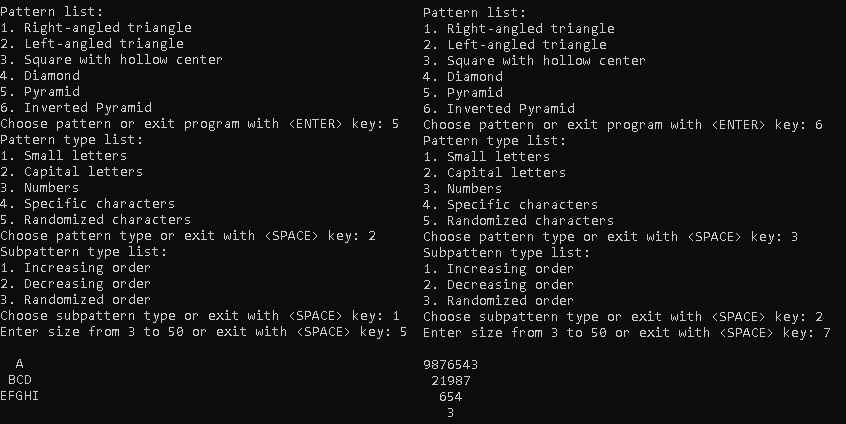

# Pattern-Drawing-with-Classes
Drawing simple patterns in python using classes

## Dependencies
1. Git - https://git-scm.com/downloads
2. Python - https://www.python.org/downloads/

## Installation
1. Choose a folder where to download it
2. Open Git Bash in it
3. Type or copy & paste: git clone https://github.com/iivanov444/Pattern-Drawing-with-Classes

## Usage
Open Terminal(Windows: PowerShell, Linux: Bash, MacOS: Terminal)
and type or copy & paste: python main_program.py

## Examples
Run the program in the Terminal and choose what pattern, subpattern and size to output

## License
MIT License
